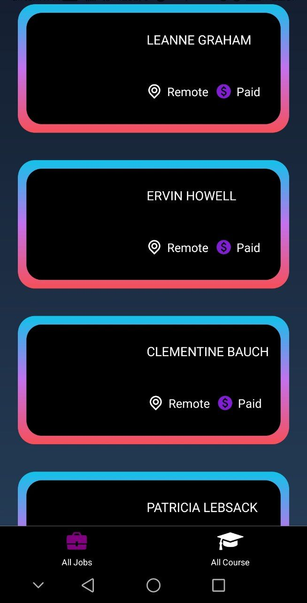
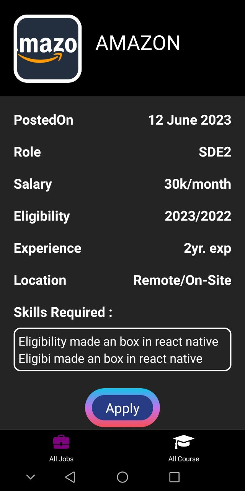
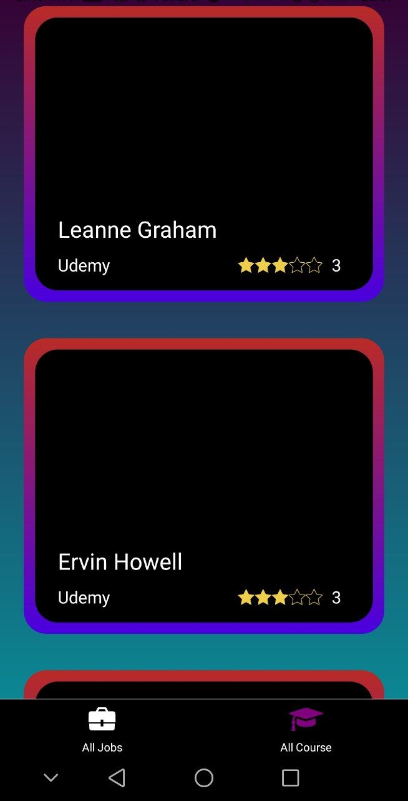
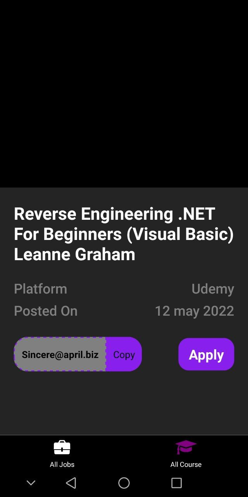

# JobBoard
api end point https://jsonplaceholder.typicode.com/users

#### Flutter App Screenshots

<table>
  <tr>
    <td>Job Page</td>
    <td>Jobdetail Page</td>
    <td>Course</td>
    <td>Coursedetail Page</td>
  </tr>
  <tr>
    <td></td>
    <td></td>
    <td></td>
    <td></td>
  </tr>
 </table>

